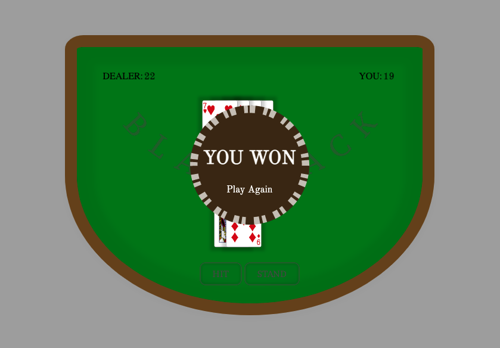

# Blackjack

## Date: 07/06/2022

### By: Jacquelin Velasquez

#### [Trello](https://trello.com/b/G4E8LQj1/blackjack) | [Wireframe](https://wireframe.cc/pro/edit/563890)
***

***
### *Description*
#### This program will be a browser version of the card game Blackjack also known as 21.  It will be created using HTML, CSS, and JavaScript.  It will also use Deck of Cards API.
***

***
### *Possible Outcomes*

###

###

***
### *Credits*
#### Deck of Cards: [Deck of Cards API](https://www.deckofcardsapi.com/)